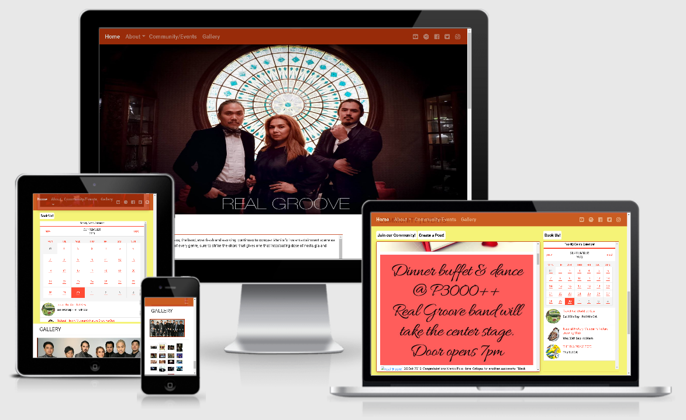

# **MILESTONE PROJECT 1** #

# **REAL GROOVE - MUSICIAN | BAND** #

Welcome to the Real-Groove website!

This website is designed to give the band fan base and it's community what the band is all about, what they are doing, gigs they will be performing and some previous gigs on their post. 

This project will demonstrate what has been learned so far throughout the 1st milestone of the Full Stack Development course provided by Code Institute and will present the webpage user useful information in using HTML and CSS.

## **CONTENTS** ##

 

- [Project Goals](#project-goals)
- [UX](#ux)
  - [User Stories](#user-stories)
    - [As Is](#as-is)
    - [To Be](#to-be)
  - [Design and Development Process](#design-process)
    - [Fonts](#fonts)
    - [Colors](#colors)
    - [Tools, Technology and Framework Used](#tools-technology-and-framework-used)
- [Features](#features)
    - [Features Implemented](#features-implemented)
    - [Future Enhancements](#future-Enhancements)
- [Testing](#testing)
    - [Encountered Issues](#encountered-issues)
    - [Known Issues](#known-issues)
- [Live Deployment](#live-deployment)
- [Credits](#credits)
- [Acknowledgements](#acknowledgements)

 

## <ins>PROJECT GOALS</ins> ##

The main objective of this 1st Milestone project was to create a website that would give the user a single page to visit that would allow them to access the band information, gigs and events, its community and gallery.

--- 
## **UX** ##

### <ins>USER STORIES</ins> ###

#### <ins>AS IS</ins> ####
- As a **new user**, I want to learn more about the band, their genre and band members and other information.
- As a **new user**, I want to learn more about the band community, their gigs and/events schedule.
- As a **new user**, I want to browse the bands gallery/photos.

#### <ins>TO BE</ins> ####
- As a **band member**, I want to be able to share the band's gig/events schedule/calendar.
- As a **new user**, I want to be able to join the band's community, create post and book the band for gigs/events i want them to be a part of.

[Back to Contents](#contents)

--- 
### <ins>DESIGN AND DEVELOPMENT</ins> ###

#### <ins>FONTS</ins> ####

- [Google Fonts](https://fonts.google.com/) - Roboto font family is used for the website

#### <ins>COLORS</ins> ####

- [Material Design](https://material.io/resources/color/#!/?view.left=0&view.right=0) - is used to measure accesibility level of any color combination in color palettes. 

#### <ins>TOOLS TECHNOLOGY and FRAMEWORK USED</ins> ####

- [Balsamic Wireframes](https://balsamiq.com/wireframes) - is used to create the initial mockup of the website. A bmpr (balsamic) version of the website design can be found <a href="assets/misc/MS-Project-1.bmpr">here</a> while a pdf version of the wireframe can be found <a href="assets/misc/MS-Project-1.pdf">here</a>. The web page initial design changed during the course of development process.
- [HTML](https://developer.mozilla.org/en-US/docs/Web/HTML)
- [CSS](https://developer.mozilla.org/en-US/docs/Web/CSS)
- [JavaScript](https://developer.mozilla.org/en-US/docs/Web/JavaScript) - this was used for the modal form and also for the "scroll up" button to allow the user to return to the top of the screen.  The JS code for this was borrowed from the W3 Schools website after a search to find out how to create this.
- [jQuery](https://jquery.com/)
- [Font-Awesome](https://fontawesome.com/icons?d=gallery) - icons used on thw website came from here.
- [Bootstrap](https://getbootstrap.com/) - Bootstrap is used for the most part of the website for its responsive design.
- [Popper](https://popper.js.org/)
- [Popper JS](https://popperjs.org/)
- [Tockify](https://public.tockify.com/browser/embed.js") - is used to embed a calendar API on the webpage.
- [Git](https://git-scm.com/) - version control and recording of all changes to site during development process
- [GitHub](https://github.com/) - used for hosting website
- [GitPod](https://www.gitpod.io/) - IDE used for code editing.
- [Chrome Developer Tools](https://developers.google.com/web/tools/chrome-devtools) - is used to debug and test site responsiveness on all screen sizes.
- [Google Fonts](https://fonts.google.com/) - used to select font families
- [W3C Validator](https://validator.w3.org/) - used to test my HTML to ensure there were no errors
- [W3C Validator CSS](https://jigsaw.w3.org/css-validator/) - used to test my CSS to ensure there were no errors
- [HTML Formatter](https://www.webformatter.com/html) - html formatter to help keep things tidy!
- [Am I Responsive](http://ami.responsivedesign.is/#) - used to create responsive image for readme.MD

[Back to Contents](#contents)

---

## **FEATURES** ##

### <ins>FEATURES IMPLEMENTED</ins> ###
- Bootstrap NavBar is used so the user can navigate the site easily.
- Social media links to the band's pages.
- Calendar of events.
- Single page that have Landing, About Us, Community and Events, and Gallery section.
- Hover is used on all clickable links.
- Modal form used for sign up, create post or contact the band.

### <ins>FUTURE ENHANCEMENTS</ins> ###
- Website admin/owner will be able to incorporate the band's calendar schedules within the community - will requires JS.
- users will be able to join/sign-up, create post and contact/book the band.
- add video gallery to include videos of the band performances.
- The addition of a search bar in the NavBar to allow instant site navigation for the user.

[Back to Contents](#contents)

---

## **TESTING** ##

The sites responsiveness was tested by the following methods:

- used different web browser (Google Chrome, Moxilla Firefox, Microsoft Edge) to check for compatibility issue.
- Physical testing was conducted on desktop, tablet and mobile devices.
- All buttons and clickable links and images were tested to ensure they are working as expected.
- Popup (modal form) window was tested to ensure that they are working as expected.
- HTML and CSS codes were formatted and validated through accessible online resources (see [Tools, Technology and Framework Used](#tools-technology-and-framework-used)) 

### <ins>ENCOUNTERED ISSUES</ins>

Below is/are the issues encountered during development and testing:

- The initial landing images was pixelized.
- Navbar collapse doesn't close/hide when user clicks a dropdown menu. Turn out a javascript is needed to address the issue encountered.
- Hieriarchial drop down menu doesn't close the navbar collapsed menu when user clicks on any hierarchial dropdown link.
- Some links are broken

### <ins>SOLUTION ON ISSUES ENCOUNTERED</ins>

Below is/are the solution provided on the issues encountered above:

- Replaced the pixelized landing image with a high resolution image.
- Created a javascript to hide the navbar collapsed menu.
- Created a javascript to determine a dropdown menu link has been cliked and call the function to hide the navbar collapsed menu within the function.
- Corrected the links.

[Back to Contents](#contents)

---

## **LIVE DEPLOYMENT** ##

The site is hosted on [GitHub Pages](https://jon2-vera-cruz.github.io/the-real-groove/).

[Back to Contents](#contents)

---

## **CREDITS** ##

Code Institute Challenges and Projects throughout 1st Milestone - I've always want to try to design a web site and the modules and online lesson makes it really easier to understand the concept behind designing your own web site.

[Back to Contents](#contents)

---

## **ACKNOWLEDGEMENTS** ##

Thank you to the following people:

- Akshat Garg, my mentor, for his time in providing guidance, and online resources to help make it through this 1st milestone project...
- Class of August-CI-2020 on Slack,
- #peer-code-review/#user-centric-frontend folks on slack (you know who you are :) )who gave some of their time reviewing and giving feedback and suggestions.

[Back to Contents](#contents)
